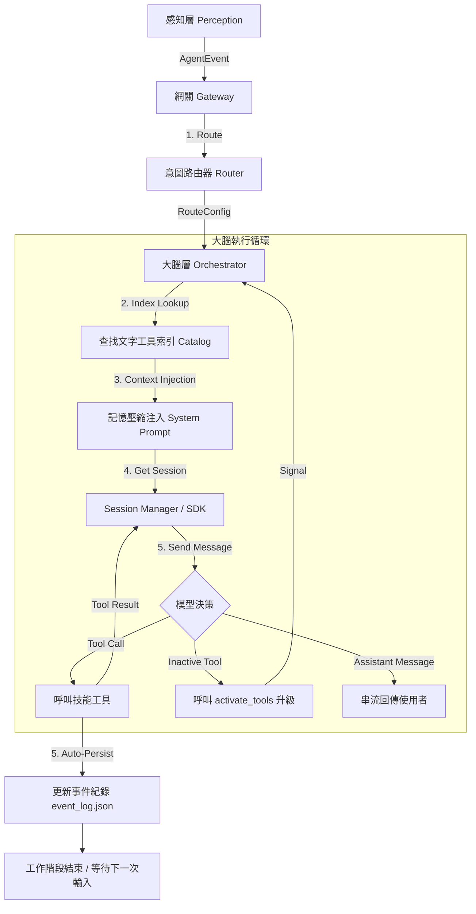

# AI Agent Modular Monolith

基於 **模組化單體 (Modular Monolith)** 架構開發的智慧型代理人系統。整合了 **FastAPI** 與 **GitHub Copilot SDK**，支援多模態輸入感知（API/Telegram）、動態意圖路由與雙層長期記憶生命週期管理。

## 🌟 核心特性

- **模組化單體架構**: 清楚的層級劃分：感知層、大腦層、記憶層、技能層 (Skills)。
- **自我進化機制 (Agentic Self-Evolution)**: Agent 可於運行時偵測能力缺失，自動編寫、測試並部署新技能，無需重啟服務。動態技能具備獨立的子進程沙盒 (Subprocess Sandbox) 隔離執行，防止記憶體洩漏與主階段阻塞。
- **元技能系統 (Meta-Skills)**: 提供 `create_tool`、`inspect_tool`、`reload_tools` 等核心開發技能。
- **本機記憶與事件追蹤 (Dual Memory Resilience)**:
  - **長期事實 (Facts)** → `storage/local_memory.json`：永久儲存使用者個人化資訊。
  - **近期事件 (Events)** → `storage/event_log.json`：具有自動清理與單行壓縮注入機制 (Hard Cap 600ch)。
- **工具索引架構 (Tool Index Architecture)**: 預設僅載入核心工具集，提供輕量化文字索引，支援透過 `activate_tools` 按需升級 Session 載入完整 Schema，徹底解決 Copilot API Payload 超限問題。
- **安全代碼驗證**: 整合 AST 靜態分析，白名單限制 import 模組，禁止危險函數 (`subprocess`, `eval` 等)。
- **自動故障修復 (Auto-Recovery)**: 偵測到 SDK 管道中斷或 400 Overflow 時，會自動支援重置 Session。且針對 400 Reset 加入了 120 秒超時保護與監聽器重綁機制。
- **異步主動回饋機制 (True Async Feedback)**: 背景委派任務完工後，會透過系統事件主動注入主助理工作階段，由主助理以自然語言推播通知，完全不需使用者輪詢。
- **依賴管理**：以 `pyproject.toml` 為唯一套件定義來源，`requirements.txt` 同步維護最低版本限制。防止 Agent 動態安裝未知依賴。（建議使用 `pip-compile` 生成完全鎖定的 lock file）
- **GitOps PR 工作流 🚧 (規劃中)**: 自動建立 GitHub Branch 並發起 PR，實現人類在環 (Human-in-the-loop) 的代碼審核。

## 📁 目錄結構

```text
my-assistant/
├── src/
│   ├── core/          # 標準化事件與介面定義
│   ├── perception/    # 感知層 (FastAPI, Gateway, Telegram)
│   ├── brain/         # 大腦層 (Router, Orchestrator, Prompts)
│   ├── memory/        # 記憶層 (Session Manager, Session Mapping)
│   └── tools/         # 技能層骨架 (Registry, BaseTool, Meta-Skills)
│       └── static/    # 元技能 (create, inspect, reload, task_control, delegate_mechanic)
├── my-tools/          # 獨立工具層 (Phase 1 分離)
│   ├── atomic/        # 預建原子工具 (web_search, url_fetcher, google_auth, local_memory...)
│   ├── server.py      # Phase 2 MCP Server 入口 (預留)
│   └── pyproject.toml # 工具專屬依賴宣告
├── requirements.txt   # 鎖定版依賴清單 (pip install -r requirements.txt)
└── storage/           # 持久化儲存區
    ├── local_memory.json     # 長期記憶 (使用者事實、偏好)
    ├── event_log.json        # 事件紀錄 / 對話摘要 (自動清理)
    ├── session_mapping.json  # 外部 ID (Telegram) → Copilot SDK UUID 對照表
    └── dynamic_tools/        # AI 自動生成的技能
        └── skills_index.json # 動態技能快速檢索總表
```

## 🧰 內建原子工具 (Atomic Tools)

| 工具名稱 | 描述 |
|---|---|
| `web_search` | 使用 DuckDuckGo 搜尋網頁 |
| `url_fetcher` | 抓取網頁內容 (BeautifulSoup) |
| `stock_loader` | 查詢即時與歷史股價 (yfinance) |
| `google_auth` | Google API OAuth2 認證 |
| `google_calendar` | 讀寫 Google 行事曆事件 |
| `activate_tools` | 動態激活/載入指定類別的工具 |
| `schedule_reminder` | 管理定期提醒任務 (支援 once, daily, weekly, yearly) |
| `send_telegram_buttons` | 在 Telegram 發送 Inline 按鈕 |
| `local_memory` | 讀寫本機長期記憶與事件紀錄 |
| `secret_manager_store` | 安全儲存各種服務或 API 的密碼、Token，支援 Docker 持久化 |
| `secret_manager_read` | 在需要呼叫外部 API 時，由背景安全抓取憑證值 |
| `secret_manager_delete` | 從安全儲存庫徹底清除某個憑證 |

## 🚀 快速開始

### 1. 環境準備

建立 `.env` 檔案並填入必要的 Token：

```bash
cp .env.example .env
```

必填變數：

- `COPILOT_GITHUB_TOKEN`: GitHub Token (需具備 `repo` 與 Copilot 相關權限)。
- `GITHUB_REPO_NAME`: PR 目標儲存庫 (格式: `owner/repo`)。**選填** (GitOps PR 功能實作後才需要)。
- `TELEGRAM_BOT_TOKEN`: 用於啟動 Telegram Bot (選填)。設定後自動啟動，並透過 Session Mapping 實現無縫的會話接續。

### 2. 安裝

本專案支援 Docker 部署與本機開發。

#### 方法 A：Docker (推薦)

```bash
docker-compose up --build
```

啟動後服務監聽於器內的 **port 8000**，是否 `docker-compose.yml` 將其映射到外部可自行調整（預設映射為 `8081:8000`）：

```bash
# REST API 存取地址
curl http://localhost:8081/health
```

#### 方法 B：本機開發 (Local Development)

若要進行開發或除錯，建議使用虛擬環境：

1. **建立並啟用虛擬環境**:

   Windows:

   ```powershell
   python -m venv venv
   .\venv\Scripts\activate
   ```

   Linux/macOS:

   ```bash
   python -m venv venv
   source venv/bin/activate
   ```

2. **安裝依賴**:

   ```bash
   pip install -r requirements.txt
   ```

3. **啟動服務**:

   ```bash
   # 務必使用 module 方式啟動，否則會遇到 Import Error
   python -m src.main
   ```

### 3. Skills API 端點

本系統提供專用的 API 來管理與監控代理人的技能：

- **`GET /skills`**: 列出當前所有已註冊的技能及其詳細參數規範。
- **`POST /skills/reload`**: 觸發熱重載，立即使新編寫的技能生效。
- **`GET /skills/{name}`**: 查詢特定技能的實作細節與 Schema。

### 4. 常見問題 (Troubleshooting)

- **Failed to list models (400)**: 代表 `COPILOT_GITHUB_TOKEN` 無效、過期或權限不足。請重新生成 Token 並確保勾選 `repo` 與 `Copilot` 相關權限（若有）。
- **ModuleNotFoundError: No module named 'src'**: 請確認您是在專案根目錄執行，且使用 `python -m src.main` 而非 `python src/main.py`。
- **SMTPAuthenticationError (535)**: 若使用 Gmail，須使用**應用程式密碼 (App Password)** 而非登入密碼。
  - 至 [Google 帳戶安全性](https://myaccount.google.com/security) 開啟兩步驟驗證，再建立應用程式密碼填入 `.env` 的 `SMTP_PASS`。
- **工具啟動時報 `error instantiating tool`**: 表示該工具的原始碼有問題（例如缺少 abstract method 的實作）。請刪除對應的 `.py` 檔案後重新啟動。
- **`400 invalid_request_body` (CAPIError)**: Session 歷史可能過長或工具 Schema 不合法。
  - *歷史過長*：系統會自動偵測並重置 Session，繼續對話。若要手動處理，可刪除 `storage/session_mapping.json` 強制建立新 Session。
  - *Schema 不合法*：確認動態工具的 `parameters` 中，`array` 型別必須有 `items`，`object` 型別必須有 `properties`。可呼叫 `inspect_tool` 工具或查看 `GET /skills/{name}` 確認格式。
- **Agent 無法讀取儲存好的憑證 (Secret Manager)**：
  - 若在 Windows/macOS **本機**執行，憑證將會存放在作業系統的 Credential Manager 內，請檢查 OS 層級管理員 (`keyring` 負責存取)。
  - 若在 **Docker** 環境執行，Secret Manager 會預設回退使用加密檔案 `.secrets.enc`。如果容器重啟後憑證遺失，請檢查是否有一併掛載 `./storage:/app/storage`，且您的 `.env` 內是否有正確的 `SECRET_MASTER_KEY` (初次啟動時自動生成)。
- **動態技能執行失敗或超時 (Timeout)**：
  - 自進化產生的動態技能 (`dynamic_tool_*.py`) 已改為獨立的子進程腳本執行。系統預設給定 15 秒的執行極限，超時將被強制中止 (`process.kill()`)。
  - 若遇執行錯誤，您可以直接手動透過命令列測試：`echo '{"arg":"val"}' | python storage/dynamic_tools/general/dynamic_tool_xxx.py`，並觀測是否成功於單行輸出合法 JSON，任何除錯資訊皆應走 `stderr`。

## 🛠️ 自我進化工作流 (Evolution Flow)

1. **偵測缺失**: 模型發現無法完成任務。
2. **自動開發**: 模型呼叫 `delegate_to_mechanic` 進行發包（Supervisor 立即恢復反應）。
3. **背景作業**: 背景技工建立專屬 Session 進行開發與自我修正。
4. **主動回報**: 完工後自動合成 `SYSTEM` 事件注入 Supervisor Session，主助理主動向使用者推播「人話」報告。
5. **熱重載**: 系統自動熱重載新工具。
6. **回饋碼庫 🚧 (規劃中)**: 模型呼叫 `submit_tool_pr` 提交 PR 給人類審核。

## 🧠 記憶系統架構

```
使用者偏好/事實
      │
      ▼
local_memory.json  ←──  local_memory tool (type: fact)
      │
      │   事件摘要/工作紀錄
      │         │
      │         ▼
      │   event_log.json  ←──  local_memory tool (type: event)
      │         │ (自動清理: 50筆 / 7天)
      │         │
      └───────── 兩者於每輪對話前讀取，注入 system_prompt (mode=replace)
                 ↓
              Orchestrator → Copilot SDK
                 (User Message 僅含純粹對話，不累積 Context)
```

## 🧩 代理人邏輯鏈 (Agent Logic Chain)

下圖展示了從接收訊息到完成任務的完整處理流程：



### 流程說明

  1. **實質異步發包 (Non-Blocking Dispatch)**：
     Supervisor 認定需要開發新工具時，使用 `delegate_to_mechanic` 工具建立背景任務（利用 `asyncio.create_task` **並將任務紀錄寫入 class 屬性**，以徹底隔離主執行緒的 `Event Loop` 並避免其被 GC 回收或阻塞）。主對話框瞬間解鎖，並自動回覆「已發包」。
  2. **雙重極限護盾 (Dual-Timeout Safeguard)**：
     主循環的 `Orchestrator` 已具備發送與等待的隔離非同步機制：
     - 若 API 連線本身塞車或卡死，**30 秒**強制切斷，防止連環假性 Timeout（確保不會吞沒連線異常）。
     - 若執行過久，**120 秒**作為思考極限斷開。
  3. **背景衝刺與主動推播 (Background Execution & Injection)**：
     背景工程師在獨立 Workspace (`internal_mechanic_workspace`) 開發完畢後，會「合成一個系統事件 (AgentEvent)」並重新呼叫 Supervisor 所在的使用者 Session。
  4. **自然對話完工通知 (Humanized Push Notification)**：
     Supervisor 收到注射進來的系統完工通知後，會以自然口吻產生總結報告，並透過 `status_callback` 直接將內容**推播回 Telegram**。使用者完全無需主動輪詢即可收到完工通知與操作指引。
  5. **意圖路由 (Routing)**：判斷使用者意圖並選取最適模型與初始 System Prompt。
  6. **記憶注入 (Context Injection)**：在每一輪對話開始前，將「長期事實 (Facts)」與「近期事件 (Events)」動態合併至 System Prompt 中。
  7. **會話管理 (Session Management)**：透過 SDK 的 `mode=replace` 機制更新指令，確保對話歷史不會包含重複的背景資訊。
  8. **遞迴調用 (Reasoning Loop)**：模型根據目前的 Context 決定是要直接回覆，還是需要呼叫工具（如網頁搜尋、寫入記憶）。
  9. **自我持久化 (Persistence)**：對話結束後，系統自動摘要本次互動的核心內容並寫入 `event_log.json`。

---

## 🗺️ 後續計畫 (Roadmap)

### 工具伺服器模組化（Single-Container MCP Architecture）

> **背景**：隨著動態工具數量增長（50+），將工具 Schema 全部注入 Session 會造成 Token 壓力。計畫將工具層重構為 [MCP（Model Context Protocol）](https://modelcontextprotocol.io/) 相容的獨立模組，但**維持單一 Docker 容器部署**，避免跨容器網路的額外複雜度。

**目標架構（單容器 · 雙進程）**：

```
┌─────────────────── Docker Container ───────────────────┐
│                                                        │
│  ┌──────────────────────┐   stdio / UDS                │
│  │  assistant-brain     │◄══════════════►┐             │
│  │  (主進程)            │                │             │
│  │  ├─ FastAPI Server   │   ┌────────────┴───────────┐ │
│  │  ├─ Orchestrator     │   │  my-tools (子進程)     │ │
│  │  ├─ SessionManager   │   │  MCP Server (stdio)    │ │
│  │  ├─ Telegram Bot     │   │  ├─ Static Tools       │ │
│  │  └─ Router           │   │  ├─ Dynamic Tools      │ │
│  └──────────────────────┘   │  ├─ Hot Reload         │ │
│                              │  └─ BaseTool 基類      │ │
│  Shared Volume:              └────────────────────────┘ │
│  /app/storage/dynamic_tools/                            │
│  /app/my-tools/                                         │
└─────────────────────────────────────────────────────────┘
```

**核心設計決策**：

| 決策 | 選項 | 理由 |
|---|---|---|
| **容器數量** | 單容器 | 省去 Docker Network、服務發現、健康檢查等額外複雜度 |
| **IPC 通道** | MCP stdio transport | MCP 原生支援 stdio，主進程 spawn 子進程即可通訊，零網路管理 |
| **工具隔離** | 獨立子進程 | 與現有 `SubprocessDynamicTool` 設計一脈相承，天然防止記憶體洩漏 |
| **程式碼分離** | Monorepo 子目錄 `my-tools/` | 邏輯獨立但共享建置上下文，Dockerfile 一次打包 |

**演化路徑**：

| 階段 | 里程碑 | 工具位置 | 載入方式 | 改動範圍 |
|---|---|---|---|---|
| **Phase 0** | ✅ 已完成 | `src/tools/static/` + `storage/dynamic_tools/` | Python import + Subprocess | — |
| **Phase 1<br>程式碼分離** | ✅ 已完成 | `my-tools/atomic/` + `src/tools/static/` (元技能) | Python import（同容器內路徑引用） | `ToolRegistry` 路徑調整，`Dockerfile COPY` 新增 `my-tools/` |
| **Phase 2<br>MCP stdio** | 🔜 暫緩 (等 SDK) | `my-tools/` 暴露 MCP stdio Server | 主進程透過 `stdio` spawn MCP Server 子進程 | 新增 `McpToolBridge`，取代 Registry 直接呼叫 |
| **Phase 3<br>SDK 原生** | 🔜 待 SDK 發布 | 同上 | Copilot SDK 原生 MCP Client | 移除自建 Bridge，改用 SDK 內建 MCP 整合 |

### Phase 1 — 程式碼分離（Monorepo 子目錄）

將工具實作從 `src/tools/` 搬遷至頂層 `my-tools/` 目錄，建立獨立 package：

```
my-assistant/            ← 本 repo (Monorepo)
├── src/                 ← 大腦層、感知層、記憶層
│   └── tools/
│       ├── registry.py  ← 只保留 Registry 骨架 + import bridge
│       └── base.py      ← 維持 BaseTool ABC (共用契約)
├── my-tools/            ← 工具層（獨立 package）
│   ├── pyproject.toml   ← 工具專屬依賴宣告
│   ├── static/          ← 原 src/tools/static/ 搬入
│   ├── dynamic/         ← 原 storage/dynamic_tools/ 運行時寫入
│   └── server.py        ← Phase 2 的 MCP Server 入口（預留）
├── storage/             ← 持久化（volume mount）
└── Dockerfile           ← COPY my-tools/ /app/my-tools/
```

**Dockerfile 異動** (預覽)：

```dockerfile
COPY pyproject.toml .
COPY requirements.txt .
COPY src/ ./src/
COPY my-tools/ ./my-tools/          # ← 新增
RUN pip install --no-cache-dir -r requirements.txt \
    && pip install --no-cache-dir ./my-tools \   # ← 安裝工具 package
    && pip install --no-cache-dir .
```

### Phase 2 — MCP stdio 整合

在 `my-tools/server.py` 實作一個輕量 MCP Server，主進程透過 stdio 通道與其溝通：

```python
# my-tools/server.py（MCP Server 入口）
from mcp.server.stdio import stdio_server
from mcp.server import Server

app = Server("my-tools")

@app.list_tools()
async def list_tools():
    # 掃描 static/ + dynamic/ 回傳 Tool Schema
    ...

@app.call_tool()
async def call_tool(name: str, arguments: dict):
    # 查找並執行對應工具
    ...

async def main():
    async with stdio_server() as (read, write):
        await app.run(read, write, app.create_initialization_options())
```

```python
# src/tools/mcp_bridge.py（主進程端 — MCP Client）
import asyncio
from mcp.client.stdio import stdio_client, StdioServerParameters

class McpToolBridge:
    """取代 ToolRegistry 的直接 import，改為透過 MCP 協定呼叫工具子進程。"""

    async def connect(self):
        server_params = StdioServerParameters(
            command="python", args=["-m", "my_tools.server"]
        )
        self._transport = await stdio_client(server_params)
        self._session = ...  # MCP ClientSession

    async def list_tools(self) -> list[dict]:
        result = await self._session.list_tools()
        return [tool.to_dict() for tool in result.tools]

    async def call_tool(self, name: str, arguments: dict) -> dict:
        result = await self._session.call_tool(name, arguments)
        return result
```

**優勢**：
- **零網路**：stdio 通道走 OS pipe，延遲 < 1ms，無需開設 port 或管理 TCP。
- **平滑降級**：MCP Server 子進程崩潰時，主進程可自動 respawn，不影響 FastAPI 健康檢查。
- **向前相容**：日後若需拆分為獨立容器，只需將 `stdio_client` 替換為 `sse_client` 或 `streamable_http_client`，協定層完全不變。

### Phase 3 — Copilot SDK 原生 MCP 支援

當 GitHub Copilot SDK 正式支援 MCP Tool Provider 時：

- 移除自建的 `McpToolBridge`
- 在 SDK Session 建立時直接注冊 MCP Server endpoint
- SDK 自行管理工具列舉、Schema 注入與呼叫轉發
- `my-tools/server.py` 無需任何修改

### Agent 自我進化適配

| 行為 | Phase 0 (現狀) | Phase 1+ |
|---|---|---|
| Mechanic 寫入新工具 | 寫入 `storage/dynamic_tools/` | 寫入 `my-tools/dynamic/` |
| 工具生效方式 | `reload_tools` → Registry 重掃 | `reload_tools` → 通知 MCP Server 重掃 |
| 工具執行隔離 | `SubprocessDynamicTool` (15s timeout) | MCP Server 子進程內執行（同等隔離） |
| 主流程改動 | — | 僅 `reload_tools` 改為發送 MCP reload signal |

### GitOps PR 工作流 🚧 (規劃中)

- Evolution Mechanic 開發完工具後，自動建立 GitHub Branch 並發起 PR
- 實現 **Human-in-the-loop** 的代碼審核，正式合併後才部署至生產環境
- 搭配 Phase 1 的 Monorepo 結構，PR 範圍可精確限定於 `my-tools/` 子目錄

---
Developed with ❤️ for AI Agent research.
