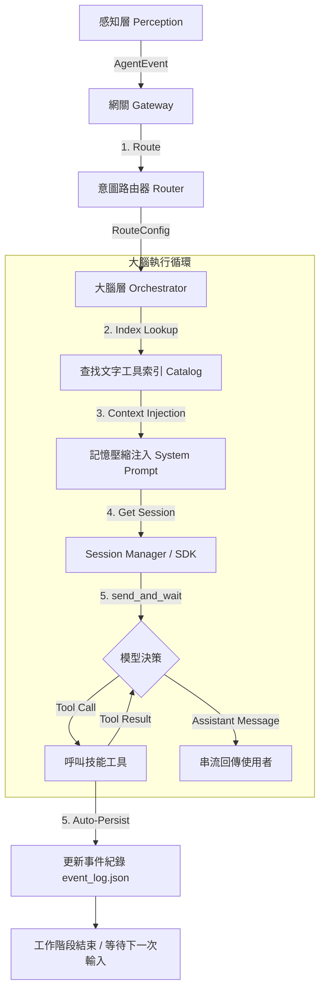

# AI Agent Modular Monolith

基於 **模組化單體 (Modular Monolith)** 架構開發的智慧型代理人系統。整合了 **FastAPI** 與 **GitHub Copilot SDK**，支援多模態輸入感知（API/Telegram）、動態意圖路由與雙層長期記憶生命週期管理。

## 🌟 核心特性

- **模組化單體架構**: 清楚的層級劃分：感知層、大腦層、記憶層、技能層 (Skills)。
- **自我進化機制 (Agentic Self-Evolution)**: Agent 可於運行時偵測能力缺失，自動編寫、測試並部署新技能，無需重啟服務。動態技能具備獨立的子進程沙盒 (Subprocess Sandbox) 隔離執行，防止記憶體洩漏與主階段阻塞。
- **元技能系統 (Meta-Skills)**: 提供 `create_tool`、`inspect_tool`、`reload_tools` 等核心開發技能。
- **本機記憶與事件追蹤 (Dual Memory Resilience)**:
  - **長期事實 (Facts)** → `storage/local_memory.json`：永久儲存使用者個人化資訊。
  - **近期事件 (Events)** → `storage/event_log.json`：具有自動清理與單行壓縮注入機制 (Hard Cap 600ch)。
- **工具索引架構 (Tool Index Architecture)**: 預設僅載入核心工具集，提供輕量化文字索引，支援透過 `activate_tools` 按需升級 Session 載入完整 Schema，徹底解決 Copilot API Payload 超限問題。
- **安全代碼驗證**: 整合 AST 靜態分析，白名單限制 import 模組，禁止危險函數 (`subprocess`, `eval` 等)。
- **自動故障修復 (Auto-Recovery)**: 偵測到 SDK 管道中斷或 400 Overflow 時，會自動支援重置 Session。且針對 400 Reset 加入了 120 秒超時保護與監聽器重綁機制。
- **異步主動回饋機制 (True Async Feedback)**: 背景委派任務完工後，會透過系統事件主動注入主助理工作階段，由主助理以自然語言推播通知，完全不需使用者輪詢。
- **依賴管理**：以 `pyproject.toml` 為唯一套件定義來源，`requirements.txt` 同步維護最低版本限制。防止 Agent 動態安裝未知依賴。（建議使用 `pip-compile` 生成完全鎖定的 lock file）
- **GitOps PR 工作流 🚧 (規劃中)**: 工具的建立與修改將改透過 GitHub Branch 與 PR 進行，實現人類在環 (Human-in-the-loop) 的代碼審核。

## 📁 目錄結構

```text
my-assistant/
├── .agents/             # Copilot Agent 設定 (rules, skills, workflows)
├── src/
│   ├── config.py        # 全域設定 (Pydantic Settings, 讀取 .env)
│   ├── main.py          # 啟動入口 (FastAPI lifespan + Telegram)
│   ├── core/            # 標準化事件與介面定義
│   ├── perception/      # 感知層 (FastAPI, Gateway, Scheduler, Telegram)
│   ├── brain/           # 大腦層 (Router, Orchestrator, Prompts, TaskManager)
│   ├── memory/          # 記憶層 (SessionManager)
│   ├── tools/           # 技能層骨架 (Registry, BaseTool)
│   │   └── static/      # 元技能 (create, inspect, reload, task_control, delegate_mechanic)
│   └── utils/           # 共用工具 (SecretManager)
├── my-tools/            # 獨立工具層 (Phase 3 MCP)
│   ├── atomic/          # MCP 伺服器託管的原子工具
│   ├── server.py        # MCP 伺服器入口 (FastMCP)
│   └── pyproject.toml   # 工具專屬依賴宣告
├── scripts/             # 除錯與診斷腳本
├── tests/               # 自動化測試
├── requirements.txt     # 鎖定版依賴清單
└── storage/             # 持久化儲存區
    ├── local_memory.json       # 長期記憶 (使用者事實、偏好)
    ├── event_log.json          # 事件紀錄 / 對話摘要 (自動清理)
    ├── .secrets.enc            # Docker 環境加密憑證檔
    ├── copilot_sdk/            # SDK Session 持久化資料
    ├── google_credentials.json # Google API 憑證
    └── dynamic_tools/          # 自進化產生的動態技能
        └── skills_index.json   # 工具文字索引 (供 activate_tools 查詢)
```

## 🧰 內建原子工具 (Atomic Tools)

| 工具名稱 | 描述 |
|---|---|
| `web_search` | 使用 DuckDuckGo 搜尋網頁 |
| `url_fetcher` | 抓取網頁內容 (BeautifulSoup) |
| `google_auth` | Google API OAuth2 認證 |
| `google_calendar` | 讀寫 Google 行事曆事件 |
| `activate_tools` | 動態激活/載入指定類別的工具 |
| `schedule_reminder` | 管理定期提醒任務 (支援 once, daily, weekly, yearly) |
| `send_telegram_buttons` | 在 Telegram 發送 Inline 按鈕 |
| `local_memory` | 讀寫本機長期記憶與事件紀錄 |
| `secret_manager_store` | 安全儲存各種服務或 API 的密碼、Token，支援 Docker 持久化 |
| `secret_manager_read` | 在需要呼叫外部 API 時，由背景安全抓取憑證值 |
| `secret_manager_delete` | 從安全儲存庫徹底清除某個憑證 |

## 🚀 快速開始

### 1. 環境準備

建立 `.env` 檔案並填入必要的 Token：

```bash
cp .env.example .env
```

必填變數：

| 變數名稱 | 必填 | 說明 |
|---|---|---|
| `COPILOT_GITHUB_TOKEN` | ✅ | GitHub Token (需具備 Copilot 相關權限) |
| `TELEGRAM_BOT_TOKEN` | 選填 | Telegram Bot Token (設定後自動啟動，支援 Session Mapping 無縫接續) |
| `COPILOT_MODEL` | 選填 | 主對話模型 (預設: `claude-sonnet-4.5`) |
| `COPILOT_EVOLUTION_MODEL` | 選填 | 自進化專用模型 (預設: `claude-sonnet-4.5`) |
| `GITHUB_REPO_NAME` | 選填 | PR 目標儲存庫 (格式: `owner/repo`，GitOps 功能規劃中) |
| `SECRET_MASTER_KEY` | 選填 | Docker 環境下加密憑證用的主金鑰 (初次啟動時自動生成) |
| `SMTP_HOST` / `SMTP_USER` / `SMTP_PASS` | 選填 | 郵件發送設定 (Gmail 需使用應用程式密碼) |

### 2. 安裝

本專案支援 Docker 部署與本機開發。

#### 方法 A：Docker (推薦)

```bash
docker-compose up --build
```

啟動後服務監聽於容器內的 **port 8000**，`docker-compose.yml` 預設映射為 `8081:8000`，可自行調整：

```bash
# REST API 存取地址
curl http://localhost:8081/health
```

#### 方法 B：本機開發 (Local Development)

若要進行開發或除錯，建議使用虛擬環境：

1. **建立並啟用虛擬環境**:

   Windows:

   ```powershell
   python -m venv venv
   .\venv\Scripts\activate
   ```

   Linux/macOS:

   ```bash
   python -m venv venv
   source venv/bin/activate
   ```

2. **安裝依賴**:

   ```bash
   pip install -r requirements.txt
   ```

3. **啟動服務**:

   ```bash
   # 務必使用 module 方式啟動，否則會遇到 Import Error
   python -m src.main
   ```

### 3. REST API 端點

系統啟動後預設監聽 `0.0.0.0:8000`，Docker 映射為 `8081:8000`。

| 方法 | 路徑 | 說明 |
|---|---|---|
| `GET` | `/health` | 健康檢查 |
| `POST` | `/chat` | 對話端點 (接受 `{"content": "..."}`) |
| `GET` | `/skills` | 列出所有已註冊的技能及參數規範 |
| `POST` | `/skills/reload` | 觸發熱重載，使新技能立即生效 |
| `GET` | `/skills/{name}` | 查詢特定技能的實作細節與 Schema |

### 4. 常見問題 (Troubleshooting)

#### 除錯 Log 地圖

- `storage/debug.log`：主程式 runtime log。優先查看 traceback、模組名稱與錯誤時間戳。
- `scripts/diagnose_output.txt`：`scripts/diagnose_tools.py` 的診斷輸出，適合用於工具載入異常排查。
- `storage/event_log.json`：近期事件摘要與流程紀錄，不等同完整例外堆疊。
- 建議排查順序：先看 `storage/debug.log`，再看 `scripts/diagnose_output.txt`，最後用 `storage/event_log.json` 補流程脈絡。

- **Failed to list models (400)**: 代表 `COPILOT_GITHUB_TOKEN` 無效、過期或權限不足。請重新生成 Token 並確保勾選 `repo` 與 `Copilot` 相關權限（若有）。
- **ModuleNotFoundError: No module named 'src'**: 請確認您是在專案根目錄執行，且使用 `python -m src.main` 而非 `python src/main.py`。
- **SMTPAuthenticationError (535)**: 若使用 Gmail，須使用**應用程式密碼 (App Password)** 而非登入密碼。
  - 至 [Google 帳戶安全性](https://myaccount.google.com/security) 開啟兩步驟驗證，再建立應用程式密碼填入 `.env` 的 `SMTP_PASS`。
- **工具啟動時報 `error instantiating tool`**: 表示該工具的原始碼有問題（例如缺少 abstract method 的實作）。請刪除對應的 `.py` 檔案後重新啟動。
- **`400 invalid_request_body` (CAPIError)**: Session 歷史可能過長或工具 Schema 不合法。
  - *歷史過長*：系統會自動偵測並重置 Session，繼續對話。新版 SessionManager 會在下一輪對話自動透過 `resume_session` 重新接續，或失敗時自動建立新 Session，無需手動操作。
  - *Schema 不合法*：確認動態工具的 `parameters` 中，`array` 型別必須有 `items`，`object` 型別必須有 `properties`。可呼叫 `inspect_tool` 工具或查看 `GET /skills/{name}` 確認格式。
- **Agent 無法讀取儲存好的憑證 (Secret Manager)**：
  - 若在 Windows/macOS **本機**執行，憑證將會存放在作業系統的 Credential Manager 內，請檢查 OS 層級管理員 (`keyring` 負責存取)。
  - 若在 **Docker** 環境執行，Secret Manager 會預設回退使用加密檔案 `.secrets.enc`。如果容器重啟後憑證遺失，請檢查是否有一併掛載 `./storage:/app/storage`，且您的 `.env` 內是否有正確的 `SECRET_MASTER_KEY` (初次啟動時自動生成)。
- **動態技能執行失敗或超時 (Timeout)**：
  - 自進化產生的動態技能 (`dynamic_tool_*.py`) 已改為獨立的子進程腳本執行。系統預設給定 15 秒的執行極限，超時將被強制中止 (`process.kill()`)。
  - 若遇執行錯誤，您可以直接手動透過命令列測試：`echo '{"arg":"val"}' | python storage/dynamic_tools/general/dynamic_tool_xxx.py`，並觀測是否成功於單行輸出合法 JSON，任何除錯資訊皆應走 `stderr`。

## 🛠️ 自我進化工作流 (Evolution Flow)

1. **偵測缺失**: 模型發現無法完成任務。
2. **自動開發**: 模型呼叫 `delegate_to_mechanic` 進行發包（Supervisor 立即恢復反應）。
3. **背景作業**: 背景技工建立專屬 Session 進行開發與自我修正。
4. **主動回報**: 完工後自動合成 `SYSTEM` 事件注入 Supervisor Session，主助理主動向使用者推播「人話」報告。
5. **熱重載**: 系統自動熱重載新工具。
6. **回饋碼庫 🚧 (規劃中)**: 模型呼叫 `submit_tool_pr` 提交 PR 給人類審核。

## 🧠 記憶系統架構

```
使用者偏好/事實
      │
      ▼
local_memory.json  ←──  local_memory tool (type: fact)
      │
      │   事件摘要/工作紀錄
      │         │
      │         ▼
      │   event_log.json  ←──  local_memory tool (type: event)
      │         │ (自動清理: 50筆 / 7天)
      │         │
      └───────── 兩者於每輪對話前讀取，注入 system_prompt (mode=replace)
                 ↓
              Orchestrator → Copilot SDK
                 (User Message 僅含純粹對話，不累積 Context)
```

## 🧩 代理人邏輯鏈 (Agent Logic Chain)

下圖展示了從接收訊息到完成任務的完整處理流程：



### 流程說明

  1. **實質異步發包 (Non-Blocking Dispatch)**：
     Supervisor 認定需要開發新工具時，使用 `delegate_to_mechanic` 工具建立背景任務（利用 `asyncio.create_task` **並將任務紀錄寫入 class 屬性**，以徹底隔離主執行緒的 `Event Loop` 並避免其被 GC 回收或阻塞）。主對話框瞬間解鎖，並自動回覆「已發包」。
  2. **SDK send_and_wait 極限護盾 (Timeout Safeguard)**：
     主循環的 `Orchestrator` 使用 SDK 原生 `send_and_wait()` 統一處理發送與等待：
     - **120 秒**作為整體回應極限，逾時自動回傳逾時訊息。
     - 管線異常 (OSError/BrokenPipeError) 自動 invalidate session，下輪自動 resume 或建立新 session。
  3. **背景衝刺與主動推播 (Background Execution & Injection)**：
     背景工程師在獨立 Workspace (`internal_mechanic_workspace`) 開發完畢後，會「合成一個系統事件 (AgentEvent)」並重新呼叫 Supervisor 所在的使用者 Session。
  4. **自然對話完工通知 (Humanized Push Notification)**：
     Supervisor 收到注射進來的系統完工通知後，會以自然口吻產生總結報告，並透過 `status_callback` 直接將內容**推播回 Telegram**。使用者完全無需主動輪詢即可收到完工通知與操作指引。
  5. **意圖路由 (Routing)**：判斷使用者意圖並選取最適模型與初始 System Prompt。
  6. **記憶注入 (Context Injection)**：在每一輪對話開始前，將「長期事實 (Facts)」與「近期事件 (Events)」動態合併至 System Prompt 中。
  7. **會話管理 (Session Management)**：`SessionManager` 使用 SDK session_id（格式 `{user_id}_{role_id}`）作為唯一識別，優先嘗試 `resume_session` 恢復歷史，失敗時自動建立新 Session。Session 設定啟用 `streaming: True` 並封鎖高危原生工具。
  8. **遞迴調用 (Reasoning Loop)**：模型根據目前的 Context 決定是要直接回覆，還是需要呼叫工具（如網頁搜尋、寫入記憶）。
  9. **自我持久化 (Persistence)**：對話結束後，系統自動摘要本次互動的核心內容並寫入 `event_log.json`。

---

## 🗺️ 後續計畫 (Roadmap)

### 工具伺服器模組化（Single-Container MCP Architecture）🔜

> **背景**：隨著動態工具數量增長（50+），將工具 Schema 全部注入 Session 會造成 Token 壓力。計畫將工具層重構為 [MCP（Model Context Protocol）](https://modelcontextprotocol.io/) 相容的獨立模組，但**維持單一 Docker 容器部署**，避免跨容器網路的額外複雜度。

**目標架構（單容器 · 雙進程）**：

```
┌─────────────────── Docker Container ───────────────────┐
│                                                        │
│  ┌──────────────────────┐   stdio                      │
│  │  assistant-brain     │◄══════════════►┐             │
│  │  (主進程)            │                │             │
│  │  ├─ FastAPI Server   │   ┌────────────┴───────────┐ │
│  │  ├─ Orchestrator     │   │  my-tools (子進程)     │ │
│  │  ├─ SessionManager   │   │  MCP Server (stdio)    │ │
│  │  ├─ Telegram Bot     │   │  ├─ Atomic Tools       │ │
│  │  └─ Router           │   │  └─ @define_tool       │ │
│  └──────────────────────┘   └────────────────────────┘ │
│                                                        │
└─────────────────────────────────────────────────────────┘
```

**演化路徑**：

| 階段 | 里程碑 | 工具位置 | 載入方式 | 改動範圍 |
|---|---|---|---|---|
| **Phase 0~2** | ✅ 已廢棄 | `storage/dynamic_tools/` + `my-tools/atomic/` | Python import + Subprocess | 過渡期架構 |
| **Phase 3<br>MCP stdio** | ✅ 已完成 | `my-tools/` 暴露 MCP stdio Server | SDK Session 原生 `mcp_servers` 設定 | 新增 `server.py`，完成路徑解析。<br>`ToolRegistry` 大幅弱化，僅保留元技能。 |

### GitOps PR 工作流 🚧 (規劃中)

- Agent 可透過閱讀原始碼了解現有的 MCP 工具實作。
- 需要擴充工具時，Agent 將修改 `my-tools/atomic/` 下的對應腳本。
- 自動建立 GitHub Branch 並發起 PR。
- 實現 **Human-in-the-loop** 的代碼審核，正式合併後才部署至生產環境。
- 搭配 Monorepo 結構，確保所有變更皆可追溯與重現。

---
Developed with ❤️ for AI Agent research.
