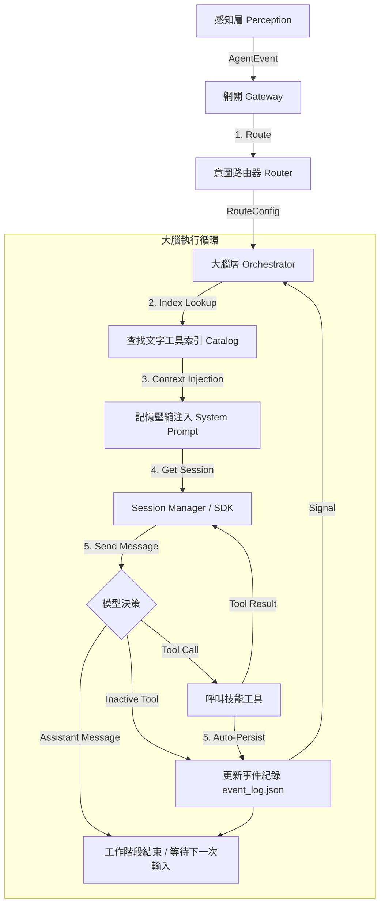

# AI Agent Modular Monolith

基於 **模組化單體 (Modular Monolith)** 架構開發的智慧型代理人系統。整合了 **FastAPI** 與 **GitHub Copilot SDK**，支援多模態輸入感知（API/Telegram）、動態意圖路由與雙層長期記憶生命週期管理。

## 🌟 核心特性

- **模組化單體架構**: 清楚的層級劃分：感知層、大腦層、記憶層、技能層 (Skills)。
- **自我進化機制 (Agentic Self-Evolution)**: Agent 可於運行時偵測能力缺失，自動編寫、測試並部署新技能，無需重啟服務。
- **元技能系統 (Meta-Skills)**: 提供 `create_tool`、`inspect_tool`、`reload_tools` 等核心開發技能。
- **本機記憶與事件追蹤 (Dual Memory Resilience)**:
  - **長期事實 (Facts)** → `storage/local_memory.json`：永久儲存使用者個人化資訊。
  - **近期事件 (Events)** → `storage/event_log.json`：具有自動清理與單行壓縮注入機制 (Hard Cap 600ch)。
- **工具索引架構 (Tool Index Architecture)**: 預設僅載入核心工具集，提供輕量化文字索引，支援透過 `activate_tools` 按需升級 Session 載入完整 Schema，徹底解決 Copilot API Payload 超限問題。
- **安全代碼驗證**: 整合 AST 靜態分析，白名單限制 import 模組，禁止危險函數 (`subprocess`, `eval` 等)。
- **自動故障修復 (Auto-Recovery)**: 偵測到 SDK 管道中斷或 400 Overflow 時，會自動重置 Session 並重試，提升系統韌性。
- **依賴鎖定 (Dependency Lockdown)**: 以 `requirements.txt` 鎖定所有套件，防止 Agent 動態安裝未知依賴。
- **GitOps PR 工作流 🚧 (規劃中)**: 自動建立 GitHub Branch 並發起 PR，實現人類在環 (Human-in-the-loop) 的代碼審核。

## 📁 目錄結構

```text
my-assistant/
├── src/
│   ├── core/          # 標準化事件與介面定義
│   ├── perception/    # 感知層 (FastAPI, Gateway, Telegram)
│   ├── brain/         # 大腦層 (Router, Orchestrator, Prompts)
│   ├── memory/        # 記憶層 (Session Manager, Session Mapping)
│   └── tools/         # 技能層
│       └── static/    # 靜態/元技能 (create, inspect, reload, task_control...)
│           └── atomic/ # 預建原子工具 (web_search, url_fetcher, stock_loader, local_memory, google_auth...)
├── requirements.txt   # 鎖定版依賴清單 (pip install -r requirements.txt)
└── storage/           # 持久化儲存區
    ├── local_memory.json     # 長期記憶 (使用者事實、偏好)
    ├── event_log.json        # 事件紀錄 / 對話摘要 (自動清理)
    ├── session_mapping.json  # 外部 ID (Telegram) → Copilot SDK UUID 對照表
    └── dynamic_tools/        # AI 自動生成的技能
        └── skills_index.json # 動態技能快速檢索總表
```

## 🧰 內建原子工具 (Atomic Tools)

| 工具名稱 | 描述 |
|---|---|
| `web_search` | 使用 DuckDuckGo 搜尋網頁 |
| `url_fetcher` | 抓取網頁內容 (BeautifulSoup) |
| `stock_loader` | 查詢即時與歷史股價 (yfinance) |
| `google_auth` | Google API OAuth2 認證 |
| `google_calendar` | 讀寫 Google 行事曆事件 |
| `activate_tools` | 動態激活/載入指定類別的工具 |
| `schedule_reminder` | 管理定期提醒任務 (支援 once, daily, weekly, yearly) |
| `send_telegram_buttons` | 在 Telegram 發送 Inline 按鈕 |
| `local_memory` | 讀寫本機長期記憶與事件紀錄 |

## 🚀 快速開始

### 1. 環境準備

建立 `.env` 檔案並填入必要的 Token：

```bash
cp .env.example .env
```

必填變數：
- `COPILOT_GITHUB_TOKEN`: GitHub Token (需具備 `repo` 與 Copilot 相關權限)。
- `GITHUB_REPO_NAME`: PR 目標儲存庫 (格式: `owner/repo`)。**選填** (GitOps PR 功能實作後才需要)。
- `TELEGRAM_BOT_TOKEN`: 用於啟動 Telegram Bot (選填)。設定後自動啟動，並透過 Session Mapping 實現無縫的會話接續。

### 2. 安裝

本專案支援 Docker 部署與本機開發。

#### 方法 A：Docker (推薦)

```bash
docker-compose up --build
```

#### 方法 B：本機開發 (Local Development)

若要進行開發或除錯，建議使用虛擬環境：

1. **建立並啟用虛擬環境**:
   
   Windows:
   ```powershell
   python -m venv venv
   .\venv\Scripts\activate
   ```

   Linux/macOS:
   ```bash
   python -m venv venv
   source venv/bin/activate
   ```

2. **安裝依賴**:
   ```bash
   pip install -r requirements.txt
   ```

3. **啟動服務**:
   ```bash
   # 務必使用 module 方式啟動，否則會遇到 Import Error
   python -m src.main
   ```

### 3. Skills API 端點

本系統提供專用的 API 來管理與監控代理人的技能：

- **`GET /skills`**: 列出當前所有已註冊的技能及其詳細參數規範。
- **`POST /skills/reload`**: 觸發熱重載，立即使新編寫的技能生效。
- **`GET /skills/{name}`**: 查詢特定技能的實作細節與 Schema。

### 4. 常見問題 (Troubleshooting)

- **Failed to list models (400)**: 代表 `COPILOT_GITHUB_TOKEN` 無效、過期或權限不足。請重新生成 Token 並確保勾選 `repo` 與 `Copilot` 相關權限（若有）。
- **ModuleNotFoundError: No module named 'src'**: 請確認您是在專案根目錄執行，且使用 `python -m src.main` 而非 `python src/main.py`。
- **SMTPAuthenticationError (535)**: 若使用 Gmail，須使用**應用程式密碼 (App Password)** 而非登入密碼。
  - 至 [Google 帳戶安全性](https://myaccount.google.com/security) 開啟兩步驟驗證，再建立應用程式密碼填入 `.env` 的 `SMTP_PASS`。
- **工具啟動時報 `error instantiating tool`**: 表示該工具的原始碼有問題（例如缺少 abstract method 的實作）。請刪除對應的 `.py` 檔案後重新啟動。
- **`400 invalid_request_body` (CAPIError)**: Session 歷史可能過長或工具 Schema 不合法。
  - *歷史過長*：系統會自動偵測並重置 Session，繼續對話。若要手動處理，可刪除 `storage/session_mapping.json` 強制建立新 Session。
  - *Schema 不合法*：確認動態工具的 `parameters` 中，`array` 型別必須有 `items`，`object` 型別必須有 `properties`。可呼叫 `inspect_tool` 工具或查看 `GET /skills/{name}` 確認格式。

## 🛠️ 自我進化工作流 (Evolution Flow)

1. **偵測缺失**: 模型發現無法完成任務。
2. **自動開發**: 模型呼叫 `create_tool` 寫入程式碼（經 AST 驗證，Import 白名單保護）。
3. **熱重載**: 模型呼叫 `reload_tools` 或透過 API `POST /skills/reload` 啟動新功能。
4. **回饋碼庫 🚧 (規劃中)**: 模型呼叫 `submit_tool_pr` 提交 PR 給人類審核。

## 🧠 記憶系統架構

```
使用者偏好/事實
      │
      ▼
local_memory.json  ←──  local_memory tool (type: fact)
      │
      │   事件摘要/工作紀錄
      │         │
      │         ▼
      │   event_log.json  ←──  local_memory tool (type: event)
      │         │ (自動清理: 50筆 / 7天)
      │         │
      └───────── 兩者於每輪對話前讀取，注入 system_prompt (mode=replace)
                 ↓
              Orchestrator → Copilot SDK
                 (User Message 僅含純粹對話，不累積 Context)
```

## 🧩 代理人邏輯鏈 (Agent Logic Chain)

下圖展示了從接收訊息到完成任務的完整處理流程：



### 流程說明：
1. **意圖路由 (Routing)**：判斷使用者意圖並選取最適模型與初始 System Prompt。
2. **記憶注入 (Context Injection)**：在每一輪對話開始前，將「長期事實 (Facts)」與「近期事件 (Events)」動態合併至 System Prompt 中。
3. **會話管理 (Session Management)**：透過 SDK 的 `mode=replace` 機制更新指令，確保對話歷史不會包含重複的背景資訊。
4. **遞迴調用 (Reasoning Loop)**：模型根據目前的 Context 決定是要直接回覆，還是需要呼叫工具（如網頁搜尋、寫入記憶）。
5. **自我持久化 (Persistence)**：對話結束後，系統自動摘要本次互動的核心內容並寫入 `event_log.json`。

---
Developed with ❤️ for AI Agent research.
